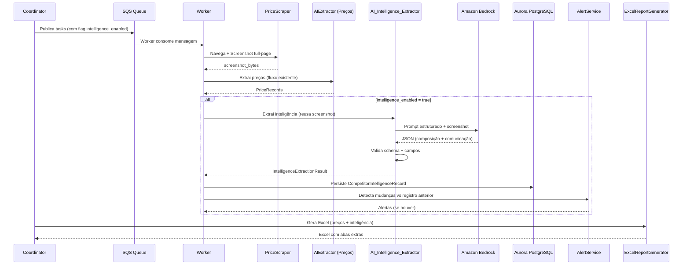
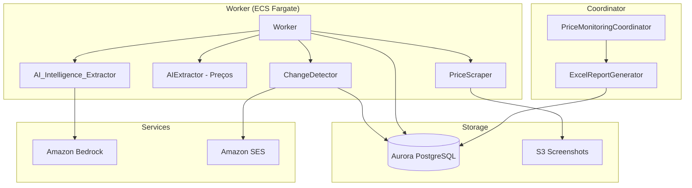
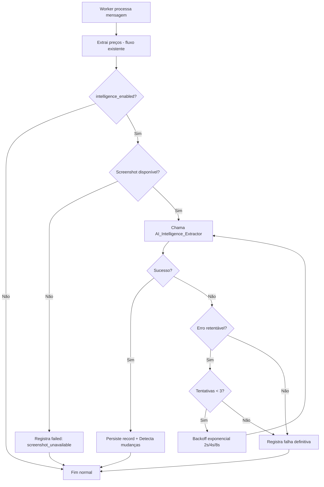

# Design Document: Expansão de Inteligência Competitiva

## Overview

Este documento detalha o design técnico para a expansão do Price Watchdog, adicionando capacidades de **inteligência competitiva** ao sistema existente de monitoramento de preços. A expansão permite extrair, via IA (Claude Sonnet no Amazon Bedrock), informações estruturadas sobre **composição de pacotes** e **comunicação comercial** dos concorrentes, além dos preços já capturados.

### Objetivos
- Extrair composição de pacotes (canais, telas, fibra, móvel, streamings) de forma estruturada
- Capturar comunicação comercial (palavras-chave, banner, posicionamento) das homes
- Persistir dados para análise histórica comparativa
- Detectar mudanças em ofertas e comunicação, gerando alertas automáticos
- Gerar relatório Excel consolidado com abas de inteligência competitiva
- Operar com degradação graciosa, sem impactar o fluxo de preços existente

### Decisões Arquiteturais Principais
1. **Reutilização de screenshots**: A extração de inteligência usa o mesmo screenshot full-page já capturado para preços, evitando navegação duplicada
2. **Componente separado (AI_Intelligence_Extractor)**: Novo extractor dedicado com prompt estruturado e schema JSON, desacoplado do AIExtractor existente de preços
3. **Flag por concorrente**: `intelligence_enabled` permite controle granular de quais concorrentes participam da extração de inteligência
4. **Tabelas dedicadas**: Novos modelos SQLAlchemy para persistência de dados de inteligência, separados das tabelas de preços

## Architecture

### Diagrama de Fluxo Integrado



### Diagrama de Componentes



### Posição no Fluxo Existente

A extração de inteligência é uma **etapa subsequente** à extração de preços dentro do mesmo processamento de mensagem no Worker. Se a extração de inteligência falhar, não impacta os dados de preço já coletados.

## Components and Interfaces

### 1. AI_Intelligence_Extractor

Componente principal responsável pela extração de dados estruturados de inteligência via Bedrock.

```python
@dataclass
class IntelligenceExtractionResult:
    """Resultado da extração de inteligência competitiva."""
    success: bool
    status: str  # "success" | "failed" | "no_packages_found"
    package_compositions: list[PackageCompositionData]
    commercial_communication: CommercialCommunicationData | None
    failure_reason: str | None = None
    retry_count: int = 0
    latency_ms: float = 0.0


@dataclass
class PackageCompositionData:
    """Dados de composição de um pacote extraído."""
    plan_name: str
    default_price: float | None
    promotional_price: float | None
    promotional_period_months: int | None
    linear_channels: int | None
    simultaneous_screens: int | None
    has_fiber: bool | None
    fiber_speed_mbps: int | None
    has_mobile_internet: bool | None
    mobile_speed_mbps: int | None
    bundled_streamings: list[str]  # até 3


@dataclass
class CommercialCommunicationData:
    """Dados de comunicação comercial extraídos."""
    commercial_keywords: list[str]  # 3 a 15, max 50 chars cada
    home_banner_description: str  # até 500 chars
    commercial_positioning_summary: str  # até 1000 chars
    keywords_status: str  # "identified" | "não identificado"
    banner_status: str  # "identified" | "não identificado"


class AIIntelligenceExtractor:
    """Extrator de inteligência competitiva via Bedrock."""
    
    MODEL_ID = "us.anthropic.claude-sonnet-4-6"
    MAX_RETRIES_RETRYABLE = 3
    MAX_RETRIES_SCHEMA = 2
    TIMEOUT_SECONDS = 120
    BACKOFF_BASE = 2  # 2s, 4s, 8s

    async def extract(
        self,
        screenshot_bytes: bytes,
        competitor_name: str,
        home_url: str | None = None,
    ) -> IntelligenceExtractionResult: ...

    async def _invoke_bedrock(
        self,
        screenshot_bytes: bytes,
        prompt: str,
    ) -> dict: ...

    def _build_prompt(self) -> str: ...
    def _validate_schema(self, data: dict) -> tuple[bool, str]: ...
    def _validate_composition(self, comp: dict) -> bool: ...
    def _normalize_streaming_name(self, name: str) -> str: ...
```

### 2. ChangeDetector

Componente para detecção de mudanças entre registros consecutivos de inteligência.

```python
class ChangeDetector:
    """Detecta mudanças em composição e comunicação comercial."""

    async def detect_changes(
        self,
        current: CompetitorIntelligenceRecord,
        competitor_id: str,
    ) -> list[IntelligenceAlert]: ...

    def _compare_compositions(
        self,
        current: list[PackageComposition],
        previous: list[PackageComposition],
    ) -> list[IntelligenceAlert]: ...

    def _compare_communication(
        self,
        current: CompetitorIntelligenceRecord,
        previous: CompetitorIntelligenceRecord,
    ) -> list[IntelligenceAlert]: ...

    def _calculate_keyword_change_pct(
        self, current: list[str], previous: list[str]
    ) -> float: ...

    def _calculate_text_similarity(
        self, text_a: str, text_b: str
    ) -> float: ...
```

### 3. IntelligenceStore

Componente de persistência para dados de inteligência.

```python
class IntelligenceStore:
    """Persistência de dados de inteligência competitiva."""

    async def save_record(
        self, record: CompetitorIntelligenceRecord
    ) -> None: ...

    async def get_previous_record(
        self, competitor_id: str
    ) -> CompetitorIntelligenceRecord | None: ...

    async def get_records_for_cycle(
        self, cycle_id: str
    ) -> list[CompetitorIntelligenceRecord]: ...
```

### 4. Extensão do Worker

O Worker existente recebe um método adicional `_process_intelligence`:

```python
# Dentro de Worker._process_multi_message (após preços)
if message.intelligence_enabled:
    await self._process_intelligence(
        screenshot_bytes=multi_result.screenshot_bytes,
        competitor_id=message.competitor_id,
        competitor_name=message.competitor_name,
        cycle_id=message.cycle_id,
        home_url=message.intelligence_home_url,
    )
```

### 5. Extensão do ExcelReportGenerator

Novas abas no relatório Excel:
- **"Composição de Pacotes"**: Uma linha por pacote com todos os atributos
- **"Comunicação Comercial"**: Uma linha por concorrente com keywords, banner e posicionamento

## Data Models

### Novas Entidades SQLAlchemy

```python
class CompetitorIntelligenceRecord(Base):
    """Registro de inteligência competitiva por ciclo/concorrente."""
    __tablename__ = "competitor_intelligence_records"

    id = Column(UUID(as_uuid=True), primary_key=True, default=uuid.uuid4)
    cycle_id = Column(UUID(as_uuid=True), ForeignKey("price_cycles.id"), nullable=False)
    competitor_id = Column(UUID(as_uuid=True), ForeignKey("competitors.id"), nullable=False)
    extraction_status = Column(String(30), nullable=False)  # success | failed | no_packages_found
    failure_reason = Column(String(500), nullable=True)
    
    # Comunicação comercial
    commercial_keywords = Column(ARRAY(String(50)), nullable=True)  # até 15 elementos
    home_banner_description = Column(String(500), nullable=True)
    commercial_positioning_summary = Column(String(1000), nullable=True)
    
    # Métricas
    extraction_latency_ms = Column(Float, nullable=True)
    retry_count = Column(Integer, default=0)
    
    # Timestamps
    extracted_at = Column(DateTime, nullable=False, default=datetime.utcnow)
    created_at = Column(DateTime, nullable=False, default=datetime.utcnow)

    # Constraint: 1 registro por (cycle_id, competitor_id)
    __table_args__ = (
        UniqueConstraint('cycle_id', 'competitor_id', name='uq_intelligence_cycle_competitor'),
    )

    # Relationships
    packages = relationship("PackageComposition", back_populates="intelligence_record", cascade="all, delete-orphan")
    competitor = relationship("Competitor")
    cycle = relationship("PriceCycle")


class PackageComposition(Base):
    """Composição de um pacote individual dentro de um registro de inteligência."""
    __tablename__ = "package_compositions"

    id = Column(UUID(as_uuid=True), primary_key=True, default=uuid.uuid4)
    intelligence_record_id = Column(
        UUID(as_uuid=True),
        ForeignKey("competitor_intelligence_records.id"),
        nullable=False
    )
    plan_name = Column(String(255), nullable=False)
    default_price = Column(Float, nullable=True)
    promotional_price = Column(Float, nullable=True)
    promotional_period_months = Column(Integer, nullable=True)
    linear_channels = Column(Integer, nullable=True)
    simultaneous_screens = Column(Integer, nullable=True)
    has_fiber = Column(Boolean, nullable=True)
    fiber_speed_mbps = Column(Integer, nullable=True)
    has_mobile_internet = Column(Boolean, nullable=True)
    mobile_speed_mbps = Column(Integer, nullable=True)
    bundled_streaming_1 = Column(String(100), nullable=True)
    bundled_streaming_2 = Column(String(100), nullable=True)
    bundled_streaming_3 = Column(String(100), nullable=True)

    # Relationship
    intelligence_record = relationship("CompetitorIntelligenceRecord", back_populates="packages")
```

### Extensão da Entidade Competitor Existente

```python
# Novos campos no Competitor:
intelligence_enabled = Column(Boolean, default=False)
intelligence_home_url = Column(String(2048), nullable=True)
```

### Extensão do PriceCycle

```python
# Novos campos no PriceCycle:
intelligence_attempted = Column(Integer, default=0)
intelligence_succeeded = Column(Integer, default=0)
intelligence_failed = Column(Integer, default=0)
```

### Extensão do PriceCheckMessage (dataclass)

```python
# Novos campos na mensagem SQS:
intelligence_enabled: bool = False
intelligence_home_url: str | None = None
```

### Schema JSON Esperado do Bedrock

```json
{
  "package_composition": [
    {
      "plan_name": "Plano X",
      "default_price": 99.90,
      "promotional_price": 79.90,
      "promotional_period_months": 12,
      "linear_channels": 150,
      "simultaneous_screens": 3,
      "has_fiber": true,
      "fiber_speed_mbps": 500,
      "has_mobile_internet": false,
      "mobile_speed_mbps": null,
      "bundled_streamings": ["Netflix", "Disney+", "Paramount+"]
    }
  ],
  "commercial_communication": {
    "commercial_keywords": ["melhor preço", "fibra ultra", "streaming grátis"],
    "home_banner_description": "Banner com oferta de Black Friday...",
    "commercial_positioning_summary": "Posicionamento focado em preço baixo..."
  }
}
```

### Diagrama ER

```mermaid
erDiagram
    Competitor ||--o{ CompetitorIntelligenceRecord : has
    PriceCycle ||--o{ CompetitorIntelligenceRecord : contains
    CompetitorIntelligenceRecord ||--o{ PackageComposition : has
    
    Competitor {
        uuid id PK
        string name
        string base_url
        bool intelligence_enabled
        string intelligence_home_url
        bool is_active
    }
    
    CompetitorIntelligenceRecord {
        uuid id PK
        uuid cycle_id FK
        uuid competitor_id FK
        string extraction_status
        string failure_reason
        array commercial_keywords
        string home_banner_description
        string commercial_positioning_summary
        float extraction_latency_ms
        int retry_count
        datetime extracted_at
    }
    
    PackageComposition {
        uuid id PK
        uuid intelligence_record_id FK
        string plan_name
        float default_price
        float promotional_price
        int promotional_period_months
        int linear_channels
        int simultaneous_screens
        bool has_fiber
        int fiber_speed_mbps
        bool has_mobile_internet
        int mobile_speed_mbps
        string bundled_streaming_1
        string bundled_streaming_2
        string bundled_streaming_3
    }
}
```

## Correctness Properties

*Uma propriedade (property) é uma característica ou comportamento que deve ser verdadeiro em todas as execuções válidas de um sistema — essencialmente, uma declaração formal sobre o que o sistema deve fazer. Propriedades servem como ponte entre especificações legíveis por humanos e garantias de corretude verificáveis por máquinas.*

### Property 1: Validação de composição de pacotes aceita dados válidos e rejeita inválidos

*Para qualquer* conjunto de dados de composição de pacote, a função de validação SHALL aceitar quando: Default_Price está entre 0.01 e 99999.99, Promotional_Price (quando presente) está entre 0.01 e 99999.99 AND ≤ Default_Price, Promotional_Period (quando presente) está entre 1 e 36, e campos numéricos (canais, telas, velocidades) são inteiros ≥ 0. SHALL rejeitar quando qualquer dessas condições for violada.

**Validates: Requirements 1.2, 5.2**

### Property 2: Campos null não marcam extração como falha

*Para qualquer* resposta JSON válida do Bedrock onde um subconjunto arbitrário de campos opcionais (linear_channels, simultaneous_screens, fiber_speed_mbps, mobile_speed_mbps, promotional_price, promotional_period) é null, a extração SHALL ter status diferente de "failed" e os campos null SHALL ser preservados como null no resultado.

**Validates: Requirements 1.3**

### Property 3: Parsing de múltiplos pacotes com limite de 20

*Para qualquer* lista de pacotes retornada pelo Bedrock com tamanho entre 1 e 25, o AI_Intelligence_Extractor SHALL parsear cada pacote individualmente e o resultado final SHALL conter no máximo 20 pacotes, descartando os excedentes.

**Validates: Requirements 1.4**

### Property 4: Validação de keywords aceita listas de 3-15 com max 50 chars

*Para qualquer* lista de keywords, a validação SHALL aceitar listas com 3 a 15 elementos onde cada elemento tem no máximo 50 caracteres, e SHALL rejeitar (marcar como "não identificado") listas com menos de 3 elementos ou com keywords excedendo 50 caracteres.

**Validates: Requirements 2.2, 2.3**

### Property 5: Truncamento de banner description a 500 caracteres

*Para qualquer* string de descrição de banner retornada pelo Bedrock, o resultado persistido SHALL ter no máximo 500 caracteres, truncando quando necessário sem perder o início do conteúdo.

**Validates: Requirements 2.4**

### Property 6: Persistência append-only preserva registros anteriores

*Para qualquer* sequência de Competitor_Intelligence_Records persistidos para um mesmo concorrente ao longo de múltiplos ciclos, cada novo registro SHALL ser inserido sem alterar ou remover os registros de ciclos anteriores — a contagem total de registros do concorrente SHALL crescer monotonicamente.

**Validates: Requirements 3.5**

### Property 7: Filtragem por intelligence_enabled

*Para qualquer* conjunto de Competitors onde um subconjunto tem intelligence_enabled=true e o restante intelligence_enabled=false, o sistema SHALL incluir na extração de inteligência APENAS os concorrentes com flag=true, e SHALL excluir os demais sem remover dados históricos existentes.

**Validates: Requirements 4.1, 8.2, 8.3**

### Property 8: Isolamento — falhas de inteligência não impactam preços

*Para qualquer* falha na extração de inteligência competitiva (timeout, resposta inválida, erro de rede), os PriceRecords já coletados naquele ciclo para o mesmo concorrente SHALL permanecer intactos e inalterados.

**Validates: Requirements 4.3, 10.1**

### Property 9: Validação de URL intelligence_home_url

*Para qualquer* string, a validação SHALL aceitar apenas URLs com esquema http ou https seguido de domínio válido, e SHALL rejeitar strings que não sejam URLs válidas (sem esquema, esquema inválido, sem domínio).

**Validates: Requirements 8.5**

### Property 10: Normalização de nomes de streaming — truncamento a 3 e remoção de sufixos

*Para qualquer* lista de nomes de streaming (0 a 10 itens) com possíveis sufixos de tier ("Basic", "Premium", "Standard"), o sistema SHALL: manter no máximo 3 streamings, normalizar cada nome removendo sufixos de tier e aplicando capitalização oficial (ex: "netflix premium" → "Netflix"), e retornar lista vazia se nenhum streaming for fornecido.

**Validates: Requirements 9.2, 9.4**

### Property 11: Detecção de mudanças em composição de pacotes

*Para qualquer* par de Competitor_Intelligence_Records consecutivos (anterior com sucesso e atual com sucesso) do mesmo concorrente, o ChangeDetector SHALL identificar corretamente todas as diferenças em atributos de composição (preço, canais, telas, streamings, velocidades) e gerar um alerta "package_composition_change" para cada atributo alterado, contendo valor anterior e valor atual.

**Validates: Requirements 7.1, 7.3**

### Property 12: Detecção de mudanças significativas em comunicação comercial

*Para quaisquer* dois conjuntos de keywords e descrições de banner, o sistema SHALL gerar alerta "communication_change" se e somente se mais de 50% das keywords mudaram (interseção/total < 0.5) OU a similaridade textual do banner for inferior a 60%.

**Validates: Requirements 7.4**

### Property 13: Relatório Excel contém abas de inteligência com estrutura correta

*Para qualquer* conjunto não-vazio de Competitor_Intelligence_Records com status "success", o ExcelReportGenerator SHALL produzir um arquivo Excel contendo: uma aba "Composição de Pacotes" com uma linha por pacote e colunas [Concorrente, Nome do Pacote, Preço Default, Preço Promocional, Duração Promo, Canais Lineares, Telas Simultâneas, Fibra, Velocidade Fibra, Internet Móvel, Velocidade Móvel, Streaming 1, Streaming 2, Streaming 3], e uma aba "Comunicação Comercial" com colunas [Concorrente, Palavras-chave, Descrição Banner, Resumo Posicionamento].

**Validates: Requirements 6.1, 6.2, 6.3**

### Property 14: Erros não-retentáveis causam falha imediata sem retry

*Para qualquer* erro classificado como não-retentável (HTTP 4xx exceto 429, erro de validação de schema após esgotamento de retries de schema, resposta não-parseável), o AI_Intelligence_Extractor SHALL registrar falha imediata com zero tentativas adicionais de chamada ao Bedrock.

**Validates: Requirements 10.3**

## Error Handling

### Estratégia de Degradação Graciosa

O princípio fundamental é: **falhas na inteligência competitiva NUNCA impactam o fluxo de preços existente**.



### Classificação de Erros

| Tipo | Exemplos | Ação |
|------|----------|------|
| Retentável | Timeout de rede, HTTP 5xx, HTTP 429 (throttling) | Até 3 retries com backoff 2s, 4s, 8s |
| Não-retentável | HTTP 4xx (exceto 429), JSON inválido, schema violation | Falha imediata |
| Schema retry | JSON válido mas campos obrigatórios ausentes ou tipos incorretos | Até 2 retries adicionais com feedback de erro no prompt |
| Timeout global | Tempo total > 120s | Abort imediato, cancela tentativas pendentes |

### Tratamento por Componente

**AI_Intelligence_Extractor:**
- Timeout individual por chamada Bedrock: 60s
- Timeout global (incluindo retries): 120s
- Retries com tenacity para erros retentáveis
- Re-prompt com indicação de erro para schema violations

**IntelligenceStore (Persistência):**
- Retry com backoff exponencial: 1s, 2s, 4s (3 tentativas)
- Em caso de falha total: log + status "persistence_failed"
- Não bloqueia processamento dos demais concorrentes

**ChangeDetector:**
- Se não encontrar registro anterior: trata como baseline (sem alerta)
- Erros na comparação: log + skip (não gera alerta falso)

**Worker (orquestração):**
- try/except isolado em torno de toda a lógica de inteligência
- Qualquer exceção não-capturada: log + continua fluxo normal
- Preços já persistidos permanecem intactos independente do resultado de inteligência

### Métricas Registradas (por ciclo)

- `intelligence_attempted`: total de extrações tentadas
- `intelligence_succeeded`: total com sucesso
- `intelligence_failed`: total com falha
- `intelligence_avg_latency_ms`: latência média por concorrente
- `intelligence_total_retries`: total de retries realizados

## Testing Strategy

### Abordagem Dual: Unit Tests + Property-Based Tests

O projeto já usa **Hypothesis** para property-based testing (43 property tests existentes). Esta expansão seguirá o mesmo padrão.

### Biblioteca PBT: Hypothesis

- Framework: `hypothesis` (já presente no projeto)
- Mínimo de **100 iterações** por property test (configuração `@settings(max_examples=100)`)
- Cada teste referencia a propriedade do design correspondente

### Property-Based Tests

Cada propriedade definida na seção de Correctness Properties será implementada como um teste PBT individual:

| Property | Módulo sob teste | Gerador |
|----------|-----------------|---------|
| 1 | `AIIntelligenceExtractor._validate_composition` | Composições com valores válidos/inválidos |
| 2 | `AIIntelligenceExtractor._parse_response` | Respostas JSON com campos null variados |
| 3 | `AIIntelligenceExtractor._parse_packages` | Listas de 0-25 pacotes |
| 4 | `AIIntelligenceExtractor._validate_keywords` | Listas de strings com tamanhos variados |
| 5 | `AIIntelligenceExtractor._validate_banner` | Strings de 0-2000 caracteres |
| 6 | `IntelligenceStore.save_record` | Sequências de records por competitor |
| 7 | `Worker._should_extract_intelligence` | Conjuntos de competitors com flags variados |
| 8 | `Worker._process_intelligence` | Cenários de falha variados |
| 9 | `Competitor.validate_intelligence_url` | Strings aleatórias (URLs válidas/inválidas) |
| 10 | `AIIntelligenceExtractor._normalize_streamings` | Listas de nomes com sufixos variados |
| 11 | `ChangeDetector._compare_compositions` | Pares de composições com diffs |
| 12 | `ChangeDetector._compare_communication` | Pares de keyword lists e textos |
| 13 | `ExcelReportGenerator.generate_intelligence_tabs` | Conjuntos de records |
| 14 | `AIIntelligenceExtractor._classify_error` | Tipos de erro variados |

### Tag Format

Cada teste será anotado com:
```python
# Feature: competitor-intelligence-expansion, Property 1: Validação de composição aceita/rejeita
```

### Unit Tests (Exemplos e Edge Cases)

| Cenário | Tipo | Requirement |
|---------|------|-------------|
| Nenhum pacote encontrado → status "no_packages_found" | Example | 1.5 |
| Página sem banner → "não identificado" | Example | 2.5 |
| Screenshot indisponível → "failed" + "screenshot_unavailable" | Edge Case | 4.5 |
| Prompt contém exemplo few-shot completo | Example | 5.4 |
| Prompt contém schema + regras + instrução do modelo | Example | 5.5 |
| Nenhum concorrente com sucesso → sem abas de inteligência | Example | 6.5 |
| Primeiro registro → baseline sem alerta | Edge Case | 7.2 |
| Novo Competitor tem intelligence_enabled=False | Example | 8.1 |
| intelligence_home_url=None → usa base_url | Example | 8.6 |

### Integration Tests (com moto/mocks)

| Cenário | Serviço mockado |
|---------|----------------|
| Chamada Bedrock com prompt correto | aioboto3 (bedrock-runtime) |
| Persistência com retry em caso de erro DB | asyncpg/SQLAlchemy |
| Retries com backoff para erros 5xx/429 | aioboto3 |
| Timeout global de 120s | asyncio.timeout |
| Envio de email de alerta via SES | aioboto3 (ses) |
| Ciclo completo com inteligência habilitada | Todos (end-to-end mock) |

### Estrutura de Diretórios de Testes

```
tests/
├── properties/
│   └── test_intelligence_properties.py  # 14 property tests
├── unit/
│   └── test_intelligence_extractor.py   # Unit + edge cases
│   └── test_change_detector.py
│   └── test_intelligence_report.py
└── integration/
    └── test_intelligence_integration.py  # Moto + mocks
```

