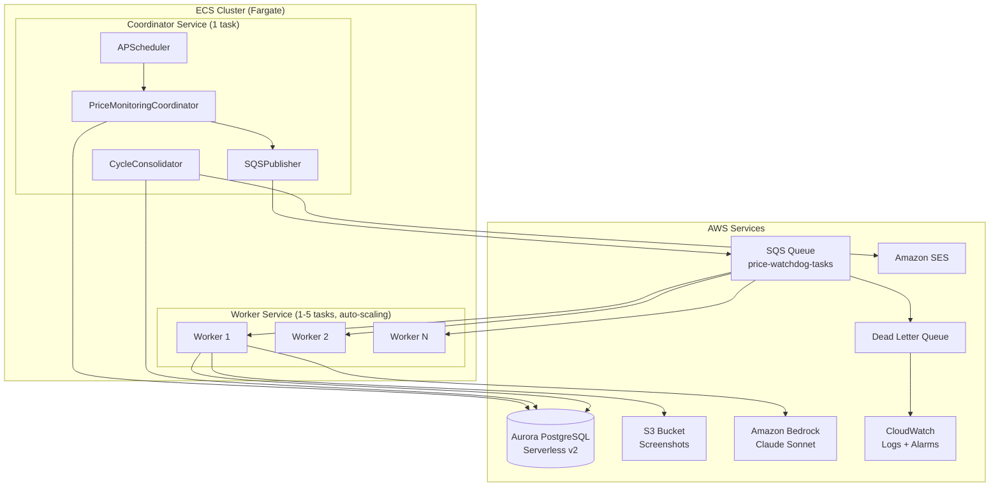
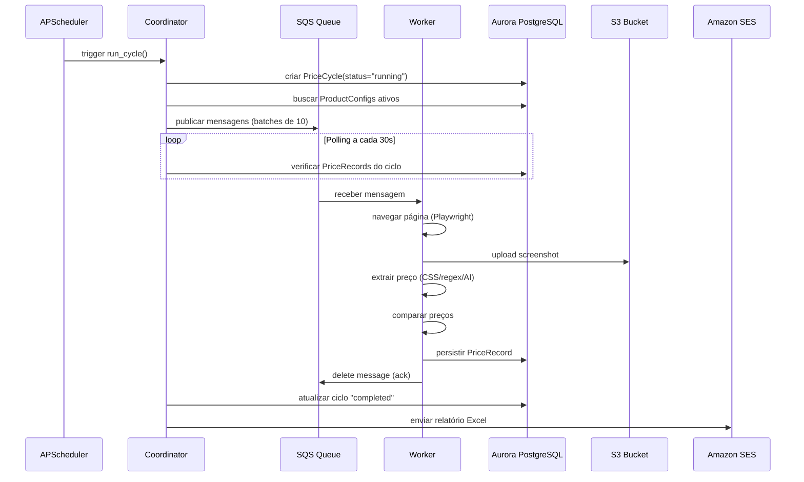
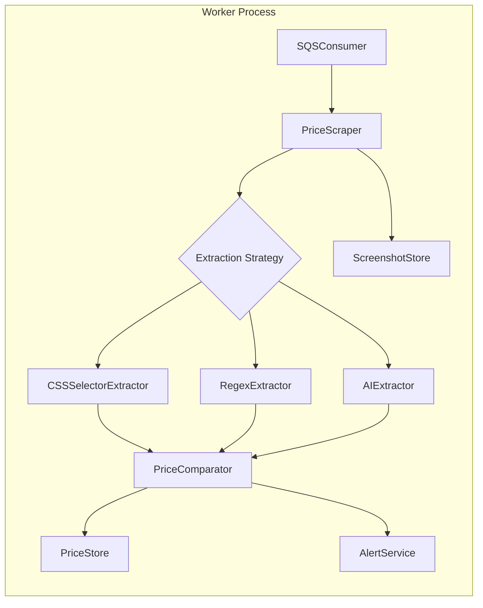
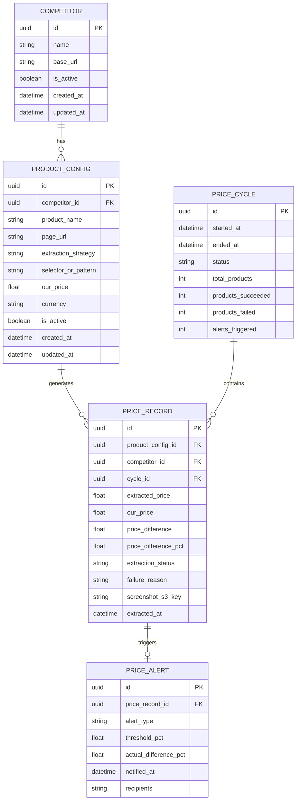

# Design Document: Price Watchdog

## Overview

O Price Watchdog é um sistema distribuído de monitoramento automatizado de preços de concorrentes (SKY+ e DGO) no mercado brasileiro de TV e streaming. O sistema opera em ciclos periódicos (padrão 12h), onde um Coordinator orquestra workers containerizados (ECS Fargate) que extraem preços de sites concorrentes usando múltiplas estratégias (CSS selectors, regex, IA via Bedrock), comparam com preços de referência, persistem resultados em Aurora PostgreSQL, e geram alertas e relatórios Excel consolidados.

### Decisões Arquiteturais Chave

| Decisão | Escolha | Justificativa |
|---------|---------|---------------|
| Linguagem | Python 3.10+ async | Ecossistema rico para scraping, async nativo com SQLAlchemy |
| Orquestração | ECS Fargate (Coordinator + Workers) | Serverless containers, sem gerenciamento de EC2 |
| Comunicação | SQS (batches de 10, visibility 120s) | Desacoplamento, retry automático, DLQ nativa |
| Navegação | Playwright + Chromium headless | Suporte a SPAs, JavaScript rendering |
| Persistência | Aurora PostgreSQL Serverless v2 | Escalabilidade automática, async com asyncpg |
| Evidências | S3 com lifecycle 30 dias | Armazenamento barato, limpeza automática |
| IA Fallback | Amazon Bedrock (Claude Sonnet) | Extração de sites complexos/dinâmicos |
| Agendamento | APScheduler | Leve, in-process, configurável |
| Relatórios | openpyxl | Geração nativa de Excel com formatação condicional |
| Email | Amazon SES | Baixo custo, integração nativa AWS |
| IaC | CloudFormation | Padrão AWS, sem dependências externas |

---

## Architecture

### Diagrama de Arquitetura de Alto Nível



### Diagrama de Sequência: Ciclo de Monitoramento



### Diagrama de Componentes do Worker



---

## Components and Interfaces

### 1. Coordinator Module (`coordinator/`)

#### `PriceMonitoringCoordinator`

Orquestra ciclos de monitoramento. Busca configurações ativas, publica tarefas na fila e monitora conclusão.

```python
class PriceMonitoringCoordinator:
    """Orquestrador principal de ciclos de monitoramento de preços."""

    def __init__(
        self,
        publisher: SQSPublisher,
        consolidator: CycleConsolidator,
        price_store: PriceStore,
        competitor_manager: CompetitorManager,
    ) -> None: ...

    async def run_cycle(self) -> PriceCycle:
        """Inicia e gerencia um ciclo completo de monitoramento."""
        ...

    async def _publish_tasks(self, cycle: PriceCycle, configs: list[ProductConfig]) -> int:
        """Publica mensagens SQS em batches de 10."""
        ...
```

#### `CycleConsolidator`

Monitora conclusão de ciclos e dispara geração de relatórios.

```python
class CycleConsolidator:
    """Consolida resultados de um ciclo e gera relatórios."""

    async def wait_for_completion(self, cycle_id: str, poll_interval: int = 30) -> PriceCycle:
        """Polling periódico até todos os PriceRecords serem processados."""
        ...

    async def consolidate(self, cycle: PriceCycle) -> None:
        """Gera relatório Excel e envia email de consolidação."""
        ...
```

### 2. Queue Module (`queue/`)

#### `SQSPublisher`

```python
class SQSPublisher:
    """Publica mensagens na fila SQS em batches."""

    async def publish_batch(self, messages: list[PriceCheckMessage]) -> int:
        """Publica até 10 mensagens por batch. Retorna quantidade enviada."""
        ...

    async def publish_all(self, messages: list[PriceCheckMessage], batch_size: int = 10) -> int:
        """Publica todas as mensagens dividindo em batches."""
        ...
```

#### `SQSConsumer`

```python
class SQSConsumer:
    """Consome mensagens da fila SQS com renovação de visibility."""

    async def receive_message(self) -> PriceCheckMessage | None:
        """Recebe uma mensagem da fila."""
        ...

    async def renew_visibility(self, receipt_handle: str, timeout: int = 120) -> None:
        """Renova visibility timeout da mensagem."""
        ...

    async def acknowledge(self, receipt_handle: str) -> None:
        """Remove mensagem da fila (processamento concluído)."""
        ...
```

#### `PriceCheckMessage`

```python
@dataclass
class PriceCheckMessage:
    """Mensagem SQS para processamento de extração de preço."""
    product_config_id: str
    competitor_id: str
    competitor_name: str
    product_name: str
    page_url: str
    extraction_strategy: str  # "css_selector" | "regex" | "ai"
    selector_or_pattern: str
    our_price: float
    cycle_id: str
```

### 3. Scraper Module (`scraper/`)

#### `PriceScraper`

```python
class PriceScraper:
    """Navega páginas e coordena extração de preços."""

    async def scrape(self, message: PriceCheckMessage) -> ScrapeResult:
        """
        Executa navegação, screenshot e extração.
        Retorna resultado com preço extraído ou razão de falha.
        """
        ...

    async def _navigate(self, url: str) -> Page:
        """Navega até URL com timeout de 30s."""
        ...

    async def _capture_screenshot(self, page: Page) -> bytes:
        """Captura screenshot full-page (max 5000px altura)."""
        ...
```

#### Extractors (`extractors.py`)

```python
class BaseExtractor(ABC):
    """Interface base para estratégias de extração."""

    @abstractmethod
    async def extract(self, page: Page, selector_or_pattern: str, product_name: str) -> ExtractionResult:
        """Extrai preço da página. Retorna ExtractionResult."""
        ...


class CSSSelectorExtractor(BaseExtractor):
    """Extrai preço via CSS selector."""

    async def extract(self, page: Page, selector: str, product_name: str) -> ExtractionResult:
        ...


class RegexExtractor(BaseExtractor):
    """Extrai preço via regex no HTML."""

    async def extract(self, page: Page, pattern: str, product_name: str) -> ExtractionResult:
        ...


class AIExtractor(BaseExtractor):
    """Extrai preço via screenshot + Amazon Bedrock."""

    async def extract(self, page: Page, product_description: str, product_name: str) -> ExtractionResult:
        ...
```

#### `PriceParser`

```python
class PriceParser:
    """Parser de preços em formato brasileiro (R$ X.XXX,XX)."""

    @staticmethod
    def parse(text: str) -> float | None:
        """
        Converte texto de preço brasileiro para float.
        'R$ 1.299,90' -> 1299.90
        Retorna None se não puder converter.
        """
        ...

    @staticmethod
    def clean(text: str) -> str:
        """Remove caracteres não-numéricos exceto ponto e vírgula."""
        ...
```

### 4. Comparator Module (`comparator/`)

```python
class PriceComparator:
    """Compara preço extraído com preço de referência."""

    def compare(self, extracted_price: float, our_price: float) -> PriceComparison:
        """
        Calcula diferenças absoluta e percentual.
        Retorna PriceComparison com os valores calculados.
        """
        ...


@dataclass
class PriceComparison:
    """Resultado da comparação de preços."""
    extracted_price: float
    our_price: float
    absolute_difference: float  # extracted - our
    percentage_difference: float  # (extracted - our) / our * 100
```

### 5. Storage Module (`storage/`)

#### `PriceStore`

```python
class PriceStore:
    """Persistência de PriceRecords no Aurora PostgreSQL."""

    async def save_record(self, record: PriceRecord) -> None:
        """Persiste um PriceRecord."""
        ...

    async def get_cycle_records(self, cycle_id: str) -> list[PriceRecord]:
        """Busca todos os records de um ciclo."""
        ...

    async def get_previous_price(self, product_config_id: str) -> float | None:
        """Busca último preço extraído com sucesso para um produto."""
        ...
```

#### `ScreenshotStore`

```python
class ScreenshotStore:
    """Armazenamento de screenshots no S3."""

    async def upload(self, screenshot_bytes: bytes, cycle_id: str, competitor_id: str) -> str:
        """Upload screenshot. Retorna S3 key."""
        ...
```

### 6. Alerts Module (`alerts/`)

#### `AlertService`

```python
class AlertService:
    """Lógica de detecção e criação de alertas de preço."""

    def evaluate(
        self, 
        current_price: float, 
        previous_price: float | None,
        our_price: float,
        thresholds: AlertThresholds,
    ) -> PriceAlert | None:
        """
        Avalia se variação de preço justifica alerta.
        Compara preço atual com preço anterior do concorrente.
        """
        ...


@dataclass
class AlertThresholds:
    price_drop_pct: float = 5.0
    price_increase_pct: float = 10.0
```

#### `EmailNotifier`

```python
class EmailNotifier:
    """Envio de emails via Amazon SES."""

    async def send_alert(self, alert: PriceAlert, recipients: list[str]) -> None:
        """Envia email de alerta com retry (3x, backoff exponencial)."""
        ...

    async def send_report(self, report_bytes: bytes, cycle: PriceCycle, recipients: list[str]) -> None:
        """Envia relatório Excel como anexo."""
        ...
```

### 7. Reports Module (`reports/`)

```python
class ExcelReportGenerator:
    """Gerador de relatório comparativo em Excel."""

    def generate(self, records: list[PriceRecord], cycle: PriceCycle) -> bytes:
        """
        Gera arquivo Excel com formatação Traffic Light.
        Colunas: Concorrente, Produto, Nosso Preço, Preço Deles, 
                 Diferença (R$), Diferença (%), Status
        """
        ...

    def _apply_traffic_light(self, worksheet, row: int, pct_diff: float) -> None:
        """Aplica formatação condicional por cores."""
        ...
```

### 8. Registry Module (`registry/`)

```python
class CompetitorManager:
    """CRUD de concorrentes e configurações de produtos."""

    async def get_active_configs(self) -> list[ProductConfig]:
        """Retorna todos os ProductConfigs ativos."""
        ...

    async def register_competitor(self, competitor: Competitor) -> Competitor:
        """Cadastra novo concorrente."""
        ...

    async def register_product_config(self, config: ProductConfig) -> ProductConfig:
        """Cadastra novo produto para monitoramento."""
        ...

    async def validate_config(self, config: ProductConfig) -> ValidationResult:
        """Valida URL acessível e formato do seletor/padrão."""
        ...

    async def update_our_price(self, config_id: str, new_price: float) -> None:
        """Atualiza preço de referência sem afetar histórico."""
        ...

    async def seed_initial_competitors(self) -> None:
        """Cria concorrentes iniciais (HBO Max, Claro TV+, Vivo TV)."""
        ...
```

### 9. Scheduler Module (`scheduler/`)

```python
class PriceWatchdogScheduler:
    """Agendamento de ciclos via APScheduler."""

    def __init__(self, coordinator: PriceMonitoringCoordinator, interval_hours: int = 12) -> None:
        ...

    def start(self) -> None:
        """Inicia scheduler com intervalo configurado."""
        ...

    def stop(self) -> None:
        """Para scheduler gracefully."""
        ...
```

---

## Data Models

### Diagrama Entidade-Relacionamento



### SQLAlchemy Models (`models/entities.py`)

```python
from sqlalchemy import Column, String, Float, Boolean, DateTime, Integer, ForeignKey, Text
from sqlalchemy.dialects.postgresql import UUID
from sqlalchemy.orm import DeclarativeBase, relationship
import uuid
from datetime import datetime


class Base(DeclarativeBase):
    pass


class Competitor(Base):
    __tablename__ = "competitors"

    id = Column(UUID(as_uuid=True), primary_key=True, default=uuid.uuid4)
    name = Column(String(255), nullable=False)
    base_url = Column(String(2048), nullable=False)
    is_active = Column(Boolean, default=True)
    created_at = Column(DateTime, default=datetime.utcnow)
    updated_at = Column(DateTime, default=datetime.utcnow, onupdate=datetime.utcnow)

    product_configs = relationship("ProductConfig", back_populates="competitor")


class ProductConfig(Base):
    __tablename__ = "product_configs"

    id = Column(UUID(as_uuid=True), primary_key=True, default=uuid.uuid4)
    competitor_id = Column(UUID(as_uuid=True), ForeignKey("competitors.id"), nullable=False)
    product_name = Column(String(255), nullable=False)
    page_url = Column(String(2048), nullable=False)
    extraction_strategy = Column(String(50), nullable=False)  # css_selector | regex | ai
    selector_or_pattern = Column(Text, nullable=False)
    our_price = Column(Float, nullable=False)
    currency = Column(String(10), default="BRL")
    is_active = Column(Boolean, default=True)
    created_at = Column(DateTime, default=datetime.utcnow)
    updated_at = Column(DateTime, default=datetime.utcnow, onupdate=datetime.utcnow)

    competitor = relationship("Competitor", back_populates="product_configs")
    price_records = relationship("PriceRecord", back_populates="product_config")


class PriceCycle(Base):
    __tablename__ = "price_cycles"

    id = Column(UUID(as_uuid=True), primary_key=True, default=uuid.uuid4)
    started_at = Column(DateTime, nullable=False, default=datetime.utcnow)
    ended_at = Column(DateTime, nullable=True)
    status = Column(String(20), nullable=False, default="running")
    total_products = Column(Integer, default=0)
    products_succeeded = Column(Integer, default=0)
    products_failed = Column(Integer, default=0)
    alerts_triggered = Column(Integer, default=0)

    price_records = relationship("PriceRecord", back_populates="cycle")


class PriceRecord(Base):
    __tablename__ = "price_records"

    id = Column(UUID(as_uuid=True), primary_key=True, default=uuid.uuid4)
    product_config_id = Column(UUID(as_uuid=True), ForeignKey("product_configs.id"), nullable=False)
    competitor_id = Column(UUID(as_uuid=True), ForeignKey("competitors.id"), nullable=False)
    cycle_id = Column(UUID(as_uuid=True), ForeignKey("price_cycles.id"), nullable=False)
    extracted_price = Column(Float, nullable=True)
    our_price = Column(Float, nullable=False)
    price_difference = Column(Float, nullable=True)
    price_difference_pct = Column(Float, nullable=True)
    extraction_status = Column(String(20), nullable=False)  # success | failed | not_found
    failure_reason = Column(Text, nullable=True)
    screenshot_s3_key = Column(String(512), nullable=True)
    extracted_at = Column(DateTime, nullable=False, default=datetime.utcnow)

    product_config = relationship("ProductConfig", back_populates="price_records")
    cycle = relationship("PriceCycle", back_populates="price_records")
    alert = relationship("PriceAlert", back_populates="price_record", uselist=False)


class PriceAlert(Base):
    __tablename__ = "price_alerts"

    id = Column(UUID(as_uuid=True), primary_key=True, default=uuid.uuid4)
    price_record_id = Column(UUID(as_uuid=True), ForeignKey("price_records.id"), nullable=False)
    alert_type = Column(String(50), nullable=False)  # price_drop | price_increase
    threshold_pct = Column(Float, nullable=False)
    actual_difference_pct = Column(Float, nullable=False)
    notified_at = Column(DateTime, nullable=True)
    recipients = Column(Text, nullable=False)  # JSON array

    price_record = relationship("PriceRecord", back_populates="alert")
```

### Dataclasses / DTOs (`models/dataclasses.py`)

```python
from dataclasses import dataclass, field
from datetime import datetime


@dataclass
class ScrapeResult:
    """Resultado completo de uma operação de scraping."""
    extraction_status: str  # "success" | "failed" | "not_found"
    extracted_price: float | None = None
    failure_reason: str | None = None
    screenshot_bytes: bytes | None = None
    screenshot_s3_key: str | None = None


@dataclass
class ExtractionResult:
    """Resultado de uma estratégia de extração."""
    success: bool
    price: float | None = None
    confidence: float | None = None  # Para AI extractor
    failure_reason: str | None = None


@dataclass
class ValidationResult:
    """Resultado da validação de um ProductConfig."""
    is_valid: bool
    errors: list[str] = field(default_factory=list)
```

---

## Correctness Properties

*Uma propriedade é uma característica ou comportamento que deve ser verdadeiro em todas as execuções válidas de um sistema — essencialmente, uma declaração formal sobre o que o sistema deve fazer. Propriedades servem como ponte entre especificações legíveis por humanos e garantias de corretude verificáveis por máquina.*

### Property 1: Round-trip de parsing de preço brasileiro

*Para qualquer* valor float positivo com até 2 casas decimais, ao formatá-lo no padrão monetário brasileiro ("R$ X.XXX,XX") e depois aplicar o `PriceParser.parse()`, o resultado deve ser igual ao valor original (com tolerância de 0.01).

**Validates: Requirements 6.1, 6.2**

### Property 2: Texto sem padrão de preço retorna None

*Para qualquer* string que não contenha nenhuma sequência de dígitos separados por vírgula no padrão numérico (ex: strings puramente alfabéticas, strings vazias, símbolos sem dígitos), o `PriceParser.parse()` deve retornar `None`.

**Validates: Requirements 6.3**

### Property 3: Cálculo de comparação de preços

*Para qualquer* par de preços (extracted_price > 0, our_price > 0), o `PriceComparator.compare()` deve produzir `absolute_difference == extracted_price - our_price` e `percentage_difference == (extracted_price - our_price) / our_price * 100`.

**Validates: Requirements 8.1**

### Property 4: Alertas baseados em thresholds de variação

*Para qualquer* par de preços (preço anterior e preço atual de um concorrente) e thresholds configurados, o `AlertService.evaluate()` deve gerar um alerta "price_drop" se e somente se a queda percentual exceder o threshold de drop, e um alerta "price_increase" se e somente se o aumento percentual exceder o threshold de increase.

**Validates: Requirements 9.1, 9.2**

### Property 5: Classificação Traffic Light determinística

*Para qualquer* `PriceRecord` com diferença percentual calculada, a classificação de cor deve ser: verde quando `our_price < extracted_price` (somos mais baratos), amarelo quando a diferença absoluta é inferior a 5%, e vermelho quando `our_price` é mais de 5% acima do concorrente.

**Validates: Requirements 10.2**

### Property 6: Mensagem SQS contém todos os campos obrigatórios (serialização round-trip)

*Para qualquer* `ProductConfig` válido, ao serializar como `PriceCheckMessage` e deserializar de volta, todos os campos obrigatórios (product_config_id, competitor_id, competitor_name, product_name, page_url, extraction_strategy, selector_or_pattern, our_price, cycle_id) devem estar presentes e iguais aos originais.

**Validates: Requirements 2.1**

### Property 7: Batching de publicação SQS

*Para qualquer* lista de N `ProductConfig` ativos (N ≥ 0), o `SQSPublisher.publish_all()` deve produzir exatamente ⌈N/10⌉ chamadas de batch, cada uma com no máximo 10 mensagens, e o total de mensagens publicadas deve ser igual a N.

**Validates: Requirements 1.2**

### Property 8: Contadores de consolidação de ciclo

*Para qualquer* conjunto de `PriceRecord` associados a um ciclo, ao consolidar o ciclo: `products_succeeded + products_failed == total_products`, e `products_succeeded` deve ser igual à contagem de records com status "success", e `products_failed` à contagem de records com status "failed" ou "not_found".

**Validates: Requirements 1.4**

### Property 9: Threshold de confidence do AI Extractor

*Para qualquer* resposta simulada do Bedrock contendo (preço, confidence), o `AIExtractor` deve aceitar o preço se e somente se `confidence >= 80`. Se `confidence < 80`, deve retornar status "failed" com razão "low_confidence".

**Validates: Requirements 5.2, 5.3**

### Property 10: S3 key contém componentes de identificação

*Para qualquer* combinação de `cycle_id`, `competitor_id` e `timestamp`, a S3 key gerada pelo `ScreenshotStore` deve conter todos os três componentes como substrings, garantindo unicidade e rastreabilidade.

**Validates: Requirements 7.2**

### Property 11: Filtragem de configs ativos exclui inativos

*Para qualquer* conjunto de `ProductConfig` com status variados (ativo/inativo), o `CompetitorManager.get_active_configs()` deve retornar apenas configs com `is_active == True`, e o conjunto retornado deve ser subconjunto do total.

**Validates: Requirements 11.3**

### Property 12: Atualização de preço não afeta registros históricos

*Para qualquer* `ProductConfig` com PriceRecords existentes, ao atualizar `our_price` no config, todos os PriceRecords anteriores devem manter o valor de `our_price` que tinham no momento da extração (imutabilidade do histórico).

**Validates: Requirements 14.4**

### Property 13: Detecção de 3 falhas consecutivas por competitor

*Para qualquer* sequência de resultados de extração de um competitor, o sistema deve gerar um alerta "extraction_strategy_outdated" se e somente se houver 3 ou mais falhas consecutivas nos ciclos mais recentes.

**Validates: Requirements 15.6**

### Property 14: Taxa de sucesso calculada corretamente

*Para qualquer* conjunto de extrações de um competitor nos últimos 30 dias, a taxa de sucesso deve ser igual a `(extrações com status "success" / total de extrações) * 100`.

**Validates: Requirements 15.7**

### Property 15: Relatório Excel contém todos os records do ciclo

*Para qualquer* conjunto de N `PriceRecord` com status "success" de um ciclo concluído, o relatório Excel gerado deve conter exatamente N linhas de dados e todas as colunas obrigatórias (Concorrente, Produto, Nosso Preço, Preço Deles, Diferença R$, Diferença %, Status).

**Validates: Requirements 10.1**

---

## Error Handling

### Estratégia de Erros por Camada

| Camada | Tipo de Erro | Comportamento |
|--------|-------------|---------------|
| Scraper | Timeout de página (30s) | Aborta navegação, retorna status "failed", registra erro |
| Scraper | Site indisponível (HTTP 5xx) | Retorna status "failed", incrementa contador de falhas |
| CSS Extractor | Seletor não encontrado | Retorna status "not_found" |
| Regex Extractor | Sem match no HTML | Retorna status "not_found" |
| AI Extractor | Low confidence (<80%) | Retorna status "failed", razão "low_confidence" |
| AI Extractor | Timeout/erro Bedrock | Retry 3x com backoff exponencial, depois "failed" |
| Price Parser | Texto não parseável | Retorna None, loga texto original |
| SQS Publisher | Falha de publicação | Marca ciclo "failed", continua para próximo |
| SQS Consumer | Mensagem corrompida | Loga erro, deixa mensagem expirar para DLQ |
| Screenshot Store | Falha upload S3 | Loga erro, continua extração normalmente |
| Email Notifier | Falha SES | Retry 3x com backoff, loga falha |
| Worker (geral) | Exceção não tratada | Registra PriceRecord "failed", prossegue |
| Coordinator | Exceção durante ciclo | Marca ciclo "failed", scheduler continua |

### Retry Policy

```python
# Configuração de retry com tenacity
RETRY_CONFIG = {
    "bedrock": {"max_attempts": 3, "base_delay": 1, "multiplier": 2},  # 1s, 2s, 4s
    "ses": {"max_attempts": 3, "base_delay": 2, "multiplier": 2},      # 2s, 4s, 8s
    "s3": {"max_attempts": 2, "base_delay": 1, "multiplier": 2},       # 1s, 2s
    "sqs_publish": {"max_attempts": 3, "base_delay": 1, "multiplier": 2},
}
```

### Degradação Graciosa

1. **Falha individual não bloqueia ciclo**: Cada extração é independente. Se um site está fora, os demais continuam.
2. **Screenshot opcional**: Se upload S3 falhar, a extração de preço continua.
3. **Alertas não-bloqueantes**: Se email não puder ser enviado, o resultado persiste no banco.
4. **DLQ como safety net**: Mensagens que falham 3x vão para DLQ com alarme automático.
5. **Alerta de estratégia outdated**: Se 3 ciclos consecutivos falham para um competitor, gera alerta para atualizar seletores.

---

## Testing Strategy

### Abordagem Dual

O projeto adota uma estratégia combinada de testes unitários (exemplos específicos) e property-based testing (propriedades universais), garantindo cobertura abrangente:

- **Property-based tests (Hypothesis)**: Validam propriedades universais com 100+ iterações por propriedade
- **Unit tests (pytest)**: Cobrem cenários específicos, edge cases e integrações mockadas
- **Integration tests (pytest + moto)**: Validam interação com serviços AWS (SQS, S3, SES)

### Biblioteca PBT: Hypothesis

O projeto utiliza [Hypothesis](https://hypothesis.readthedocs.io/) como biblioteca de property-based testing, já listada nas dependências de desenvolvimento do `pyproject.toml`.

### Configuração PBT

- Mínimo 100 iterações por propriedade
- Cada teste de propriedade referencia o property do design document
- Tag format: `Feature: price-watchdog, Property {number}: {property_text}`

### Mapeamento de Properties para Testes

| Property | Módulo Testado | Arquivo de Teste |
|----------|---------------|------------------|
| 1 (Round-trip parsing) | `scraper/extractors.py` → `PriceParser` | `tests/test_price_parser_props.py` |
| 2 (Texto inválido → None) | `scraper/extractors.py` → `PriceParser` | `tests/test_price_parser_props.py` |
| 3 (Cálculo comparação) | `comparator/comparator.py` | `tests/test_comparator_props.py` |
| 4 (Alertas threshold) | `alerts/alert_service.py` | `tests/test_alerts_props.py` |
| 5 (Traffic Light) | `reports/excel_report.py` | `tests/test_report_props.py` |
| 6 (Serialização SQS) | `queue/messages.py` | `tests/test_messages_props.py` |
| 7 (Batching SQS) | `queue/publisher.py` | `tests/test_publisher_props.py` |
| 8 (Contadores ciclo) | `coordinator/cycle_consolidator.py` | `tests/test_consolidator_props.py` |
| 9 (Confidence AI) | `scraper/extractors.py` → `AIExtractor` | `tests/test_ai_extractor_props.py` |
| 10 (S3 key) | `storage/screenshot_store.py` | `tests/test_screenshot_store_props.py` |
| 11 (Filtragem ativos) | `registry/competitor_manager.py` | `tests/test_registry_props.py` |
| 12 (Imutabilidade histórico) | `registry/competitor_manager.py` | `tests/test_registry_props.py` |
| 13 (3 falhas consecutivas) | `alerts/alert_service.py` | `tests/test_alerts_props.py` |
| 14 (Taxa sucesso) | `registry/competitor_manager.py` | `tests/test_registry_props.py` |
| 15 (Relatório completo) | `reports/excel_report.py` | `tests/test_report_props.py` |

### Unit Tests (Exemplos e Edge Cases)

| Cenário | Módulo | Tipo |
|---------|--------|------|
| Coordinator inicia ciclo com status "running" | `coordinator/` | Example |
| Falha de publicação marca ciclo "failed" | `coordinator/` | Example |
| Timeout de 30s aborta navegação | `scraper/` | Edge Case |
| CSS selector não encontrado retorna "not_found" | `scraper/` | Edge Case |
| Regex sem match retorna "not_found" | `scraper/` | Edge Case |
| Upload S3 falha mas extração continua | `storage/` | Example |
| Seeding de 3 concorrentes iniciais | `registry/` | Example |
| Retry 3x do Bedrock com backoff | `scraper/` | Example |
| Retry 3x do SES com backoff | `alerts/` | Example |

### Integration Tests

| Cenário | Serviços | Ferramenta |
|---------|----------|------------|
| Publicar e consumir mensagem SQS | SQS | moto |
| Upload/download screenshot S3 | S3 | moto |
| CRUD completo no Aurora | PostgreSQL | pytest-asyncio + testcontainers |
| Scraping de página HTML mockada | Playwright | pytest + HTML fixture |

### Estrutura de Diretórios de Testes

```
tests/
├── conftest.py                      # Fixtures globais
├── properties/                      # Property-based tests
│   ├── test_price_parser_props.py   # Properties 1, 2
│   ├── test_comparator_props.py     # Property 3
│   ├── test_alerts_props.py         # Properties 4, 13
│   ├── test_report_props.py         # Properties 5, 15
│   ├── test_messages_props.py       # Property 6
│   ├── test_publisher_props.py      # Property 7
│   ├── test_consolidator_props.py   # Property 8
│   ├── test_ai_extractor_props.py   # Property 9
│   ├── test_screenshot_store_props.py # Property 10
│   └── test_registry_props.py       # Properties 11, 12, 14
├── unit/                            # Unit tests (exemplos)
│   ├── test_coordinator.py
│   ├── test_scraper.py
│   ├── test_extractors.py
│   ├── test_consumer.py
│   └── test_alert_service.py
└── integration/                     # Integration tests
    ├── test_sqs_integration.py
    ├── test_s3_integration.py
    └── test_database_integration.py
```

